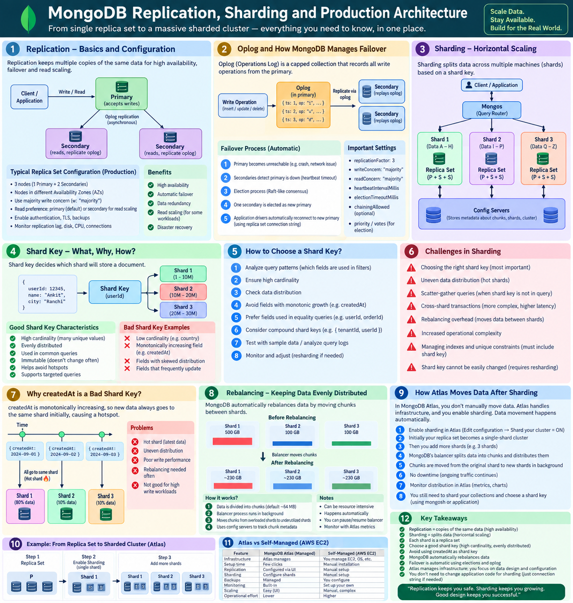
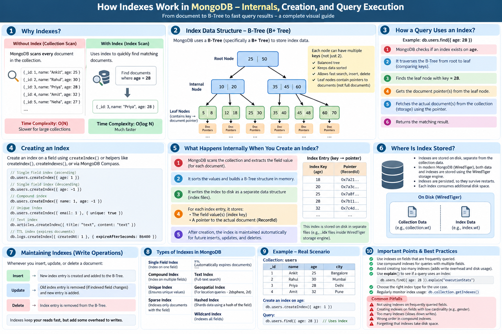

## Mongo Basic :


## Mongo Basic :


## Mongo Shard and Replication  and oplog:



## Mongo Indexs:


```js
const result = await Order.aggregate([
  {
    $match: {
      status: "completed"
    }
  },

  {
    $group: {
      _id: "$userId",
      totalSpent: {
        $sum: "$amount"
      },
      orderCount: {
        $sum: 1
      }
    }
  },

  {
    $lookup: {
      from: "users",
      localField: "_id",
      foreignField: "_id",
      as: "user"
    }
  },

  {
    $unwind: "$user"
  },

  {
    $project: {
      _id: 0,
      name: "$user.name",
      totalSpent: 1,
      orderCount: 1
    }
  },

  {
    $sort: {
      totalSpent: -1
    }
  },

  {
    $limit: 5
  }
]);
```


**## Mongo Read, Write Concern and Majority:**

- **Write Concern** → controls when MongoDB acknowledges a write.
- **`w: "majority"`** → wait for acknowledgement from a majority of voting nodes.
- **Read Concern** → controls what level of committed/consistent data a read can see.
- **`readConcern: "majority"`** → read majority-committed data.
- **Read Preference** → controls which replica-set node is preferred for reads.
- **Majority** → more than half of voting members.
  - 3 nodes → majority = 2
  - 5 nodes → majority = 3

```js
{
  writeConcern: { w: "majority" },
  readConcern: { level: "majority" },
  readPreference: "primary"
}

### Write Concern
// MongoDB
db.users.insertOne(
  { name: "Ankit" },
  { writeConcern: { w: "majority" } }
)


### Read / Write Concern at Mongoose Schema Level

const userSchema = new mongoose.Schema(
  {
    name: String,
    email: String
  },
  {
    writeConcern: {
      w: "majority"
    },

    readConcern: {
      level: "majority"
    }
  }
);

```