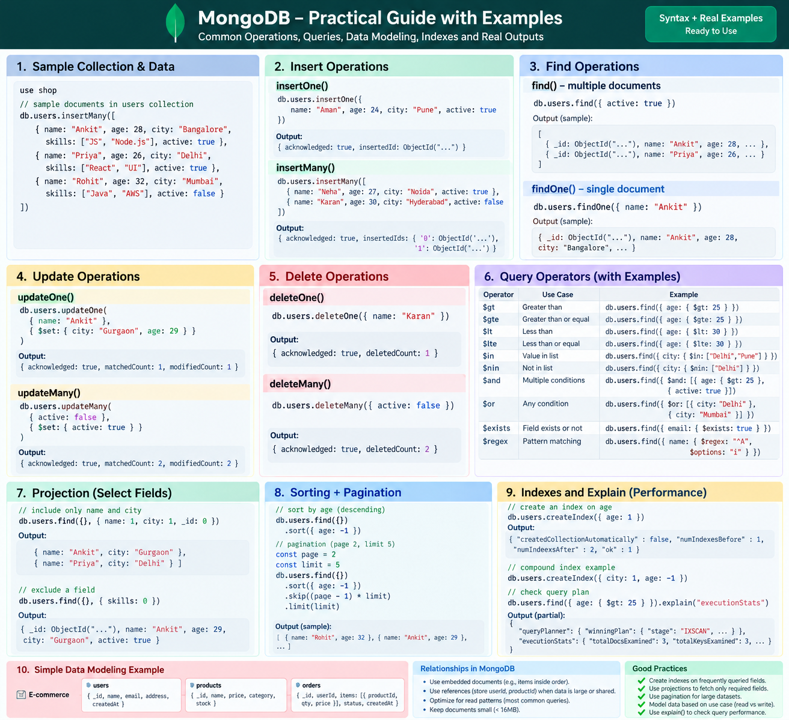
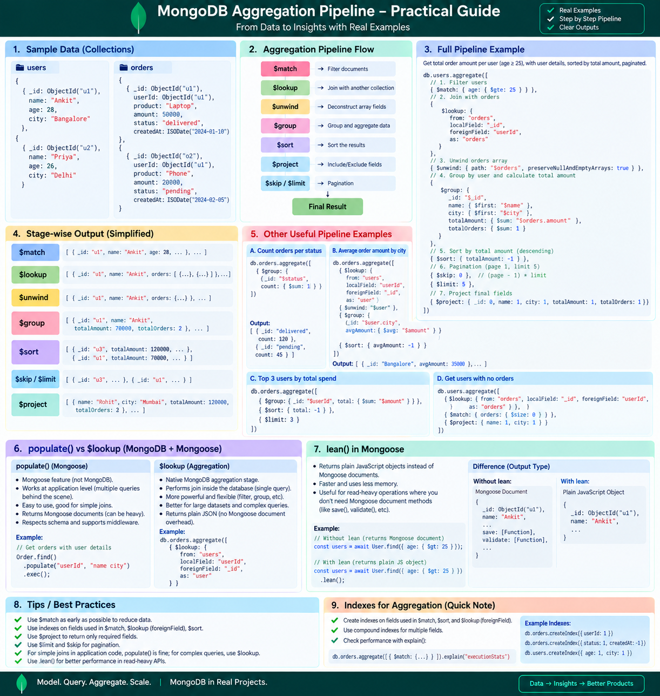

## Mongo Basic :



## Mongo Basic :


<!-- PENDING
SHARDING
REPLICATION 
CHALLENGES 
HOSTING
 -->

```js
const result = await Order.aggregate([
  {
    $match: {
      status: "completed"
    }
  },

  {
    $group: {
      _id: "$userId",
      totalSpent: {
        $sum: "$amount"
      },
      orderCount: {
        $sum: 1
      }
    }
  },

  {
    $lookup: {
      from: "users",
      localField: "_id",
      foreignField: "_id",
      as: "user"
    }
  },

  {
    $unwind: "$user"
  },

  {
    $project: {
      _id: 0,
      name: "$user.name",
      totalSpent: 1,
      orderCount: 1
    }
  },

  {
    $sort: {
      totalSpent: -1
    }
  },

  {
    $limit: 5
  }
]);
```