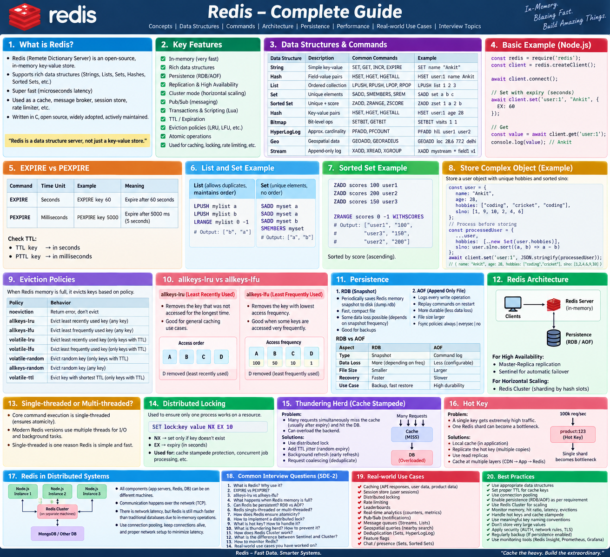

## Redis Detailed :


* By default RDB is enabled but AOF can be enabled by updating the config of redis.

# Cache Invalidation

**Definition:**
Cache invalidation means **removing or updating stale data from the cache when the source-of-truth data changes**.

> Goal: **Cache should not serve outdated data.**

---

## Why Cache Invalidation?

Suppose:

```text
DB:    User → age: 25
Redis: User → age: 25
```

User updates age:

```text
DB:    User → age: 26
Redis: User → age: 25 [wrong]
```

Redis now contains **stale data**.

We need an invalidation strategy to keep cache consistent with the DB.

---

# Common Cache Invalidation Strategies

## 1. TTL — Time To Live

Store data with an expiry time.

```js
await redis.set(
  `user:${userId}`,
  JSON.stringify(user),
  { EX: 300 }
);
```

After **300 seconds**, Redis automatically removes the key.

### Pros

* Simple
* Prevents data from staying stale forever
* No manual deletion required

### Cons

* Data can remain stale until TTL expires

```text
DB updated
   ↓
Redis still old
   ↓
TTL expires
   ↓
Redis deleted
```

**Best for:** Data where slight staleness is acceptable.

---

## 2. Cache-Aside / Lazy Invalidation

Most commonly used pattern.

### Read

```text
Request
   ↓
Check Redis
   ↓
Cache HIT → return data
   ↓
Cache MISS
   ↓
Read DB
   ↓
Store in Redis
   ↓
Return data
```

### Update

```text
Update DB
   ↓
Delete Redis key
```

Example:

```js
await User.findByIdAndUpdate(userId, data);

await redis.del(`user:${userId}`);
```

Next request:

```text
Redis MISS
   ↓
DB
   ↓
Fresh data
   ↓
Redis
```

### Key idea

> **DB is source of truth; Redis is a temporary copy.**

---

## 3. Write-Through Cache

Application writes to the cache, and the cache writes to DB.

```text
Application
     ↓
   Redis
     ↓
     DB
```

Both are updated during the write.

### Pros

* Cache remains fresh
* Good read performance

### Cons

* More complexity
* Every write goes through cache

---

## 4. Write-Behind / Write-Back

Application writes to cache first.

```text
Application
     ↓
   Redis
     ↓
   Later
     ↓
     DB
```

DB update happens asynchronously.

### Pros

* Very fast writes
* Can batch DB writes

### Cons

* Data-loss risk if cache fails before DB persistence
* More complex

**Use carefully for critical data.**

---


You may need to invalidate multiple keys.

### Best for

* User profiles
* Product details
* Frequently changing application data

---

### Useful when

* Many related cache keys exist
* Bulk invalidation is difficult
* You want to avoid deleting thousands of keys

---

# 5. Event-Based Invalidation

For distributed systems, publish an event whenever data changes.

```text
Service A
   ↓
Update DB
   ↓
Publish "UserUpdated"
   ↓
Kafka / Redis PubSub
   ↓
Service B
   ↓
Invalidate Redis
```

Example:

```text
User Service
     │
     ├── DB UPDATE
     │
     └── UserUpdated Event
              ↓
          Message Broker
              ↓
       Other Services
              ↓
         DEL cache key
```

### Best for

* Microservices
* Multiple application servers
* Distributed caches

---

# Practical Redis Strategy

For most REST APIs:

```text
                 READ
                  │
                  ▼
              Redis?
             /       \
          HIT         MISS
           │            │
           ▼            ▼
        Return         DB
                         │
                         ▼
                      Redis
                         │
                         ▼
                       Return


                 UPDATE
                   │
                   ▼
                  DB
                   │
                   ▼
             Delete Redis
```

Example:

```js
// GET
const cached = await redis.get(`user:${id}`);

if (cached) {
  return JSON.parse(cached);
}

const user = await User.findById(id);

await redis.set(
  `user:${id}`,
  JSON.stringify(user),
  { EX: 300 }
);

return user;
```

```js
// UPDATE
const user = await User.findByIdAndUpdate(
  id,
  req.body,
  { new: true }
);

// Invalidate cache
await redis.del(`user:${id}`);

return user;
```

---

# Which Strategy Should I Use?

| Strategy            | Main Idea                  | Typical Use              |
| ------------------- | -------------------------- | ------------------------ |
| **TTL**             | Automatically expire       | Almost every cache       |
| **Cache-Aside**     | DB update → delete cache   | Most APIs                |
| **Write-Through**   | Write cache + DB           | Stronger cache freshness |
| **Write-Behind**    | Cache first → DB later     | High-write systems       |
| **Event-Based**     | Publish invalidation event | Microservices            |
---
