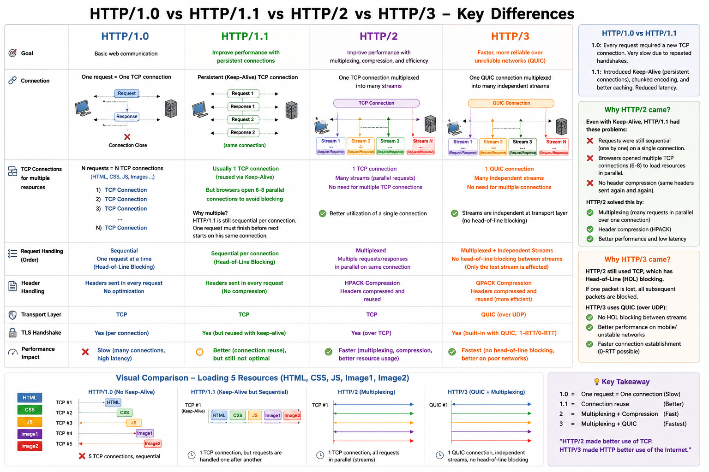

## All Http Variants Detailed :


# QUIC, HPACK & QPACK

**QUIC**

* UDP-based transport protocol used by **HTTP/3**.
* Provides reliability, encryption, multiplexing, and faster connection setup.
* Avoids TCP head-of-line blocking using independent streams.

**HPACK**

* Header compression used by **HTTP/2**.
* Uses **static and dynamic tables**.
* Dynamic table **learns repeated headers while multiple API requests are sent** and reuses them to reduce header size.

**QPACK**

* Header compression used by **HTTP/3**.
* Similar to HPACK but designed for **QUIC's independent streams**.

**Flow:**

```text
HTTP/2 → TCP → HPACK
HTTP/3 → QUIC → UDP → QPACK
```
