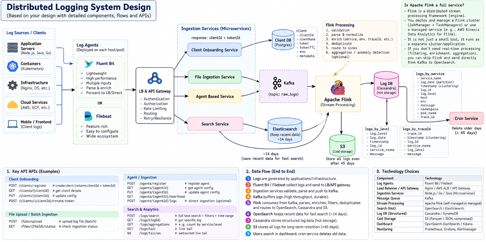

## Distributed Log Pattern:



Cassandra is commonly modeled around the queries/access patterns you need, rather than starting with one normalized log table and then adding arbitrary indexes afterward.

* Cassandra are very fast for write querys

* OpenSearch mein indexing is fundamental. The key difference is that when you say logs_by_level in Cassandra, you're talking about a Cassandra table designed around a query, while logs-production in OpenSearch is an index containing documents, with OpenSearch's internal indexing structures making fields searchable.

```
openseach index


logs-production
│
├── document 1
├── document 2
├── document 3
├── ...
└── document 1 billion
```