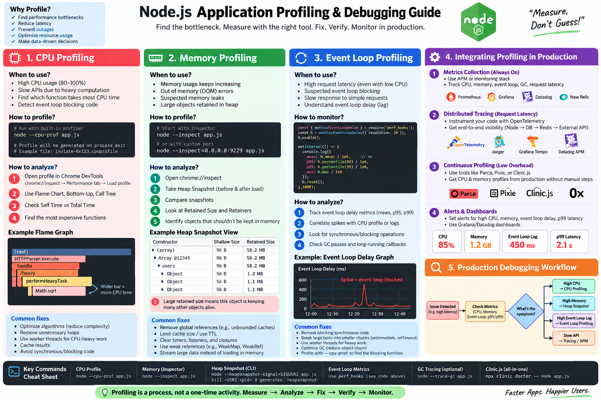
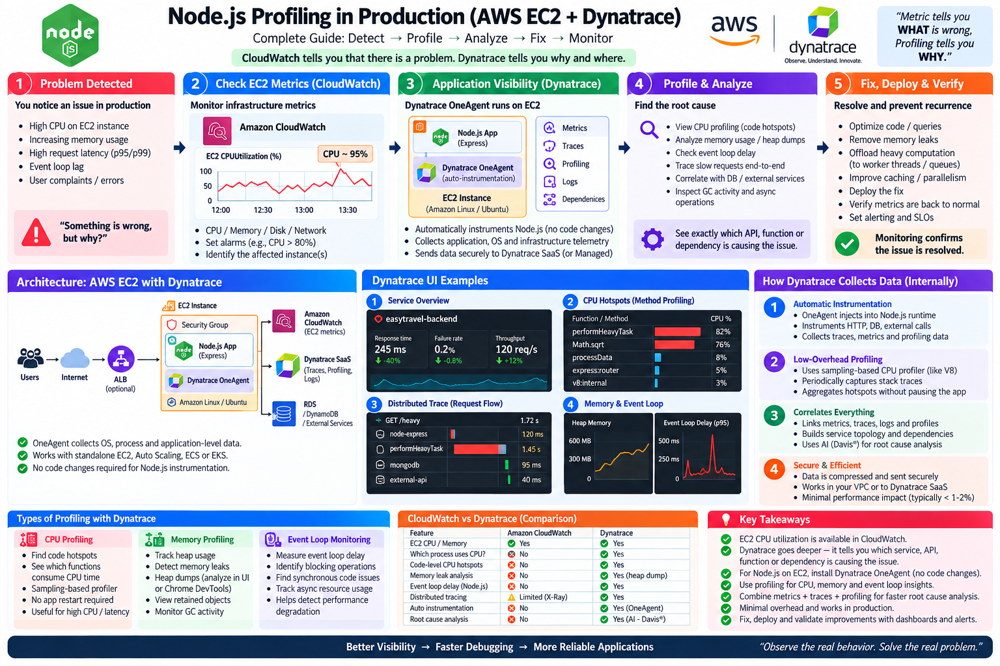

## Node Server Profling:

## Node Server Profling in prod env.:

              EC2
               │
        CPU = 76%
               │
               ▼
      Dynatrace OneAgent
               │
               ▼
        CPU metric
               │
               ▼
       ┌─────────────────┐
       │ Threshold       │
       │ CPU > 75%       │
       │ for 5 minutes   │
       └────────┬────────┘
                │
                ▼
        Dynatrace Problem
                │
                ▼
          Workflow
                │
                ▼
          Send Email
                │
                ▼
      "EC2 CPU is above 75%"

For detailed code - https://github.com/ankitsharma9122/BE-guide-code/blob/main/profiling/CpuProfile.js