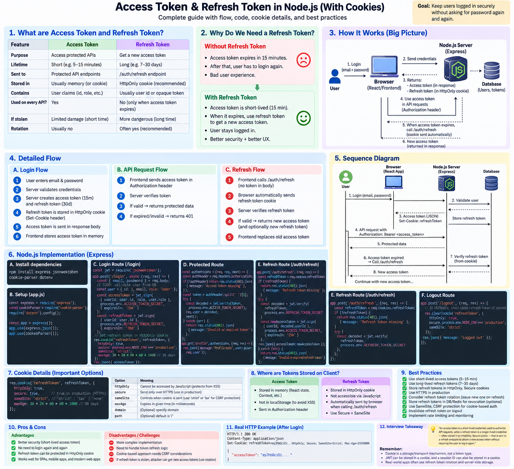
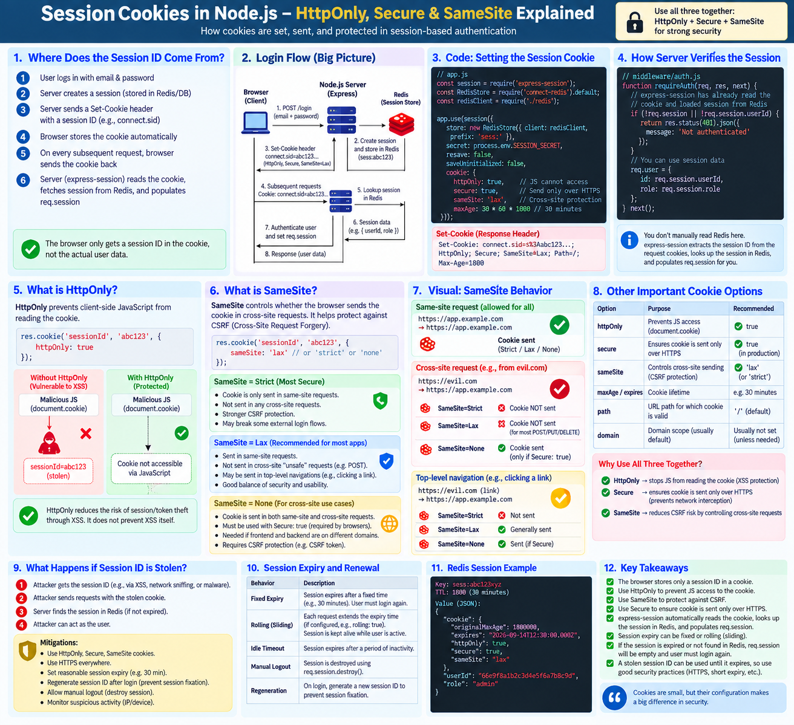

# Stateful vs Stateless

## 1. Stateful

A **stateful system stores information (state) about the client/session on the server**.

### Flow

```text
Client
  ↓
Login
  ↓
Server creates session
  ↓
Session stored on server
  ↓
Client receives Session ID
```

Next request:

```text
Client → Session ID → Server
                     ↓
              Find session
                     ↓
               User = Ankit
```

The server **remembers previous interactions**.

### Example

Server stores:

```js
sessions = {
  "abc123": {
    userId: 101,
    role: "admin"
  }
};
```

Client sends:

```text
Cookie: sessionId=abc123
```

Server looks up `abc123` and gets the user's session.

### Problems

* Server has to maintain session state.
* Scaling becomes more complicated.
* Requests may need to reach the same server (**sticky sessions**) or sessions must be stored in a shared store such as Redis.

---

# 2. Stateless

A **stateless system does not store client-specific session state on the server**.

Each request contains enough information for the server to process it independently.

### Flow

```text
Client
  ↓
Request + JWT
  ↓
Any Server
  ↓
Verify JWT
  ↓
Process request
```

Example:

```text
Authorization: Bearer <JWT>
```

The server verifies the token and gets the required information from it.

### Scaling

```text
                 Load Balancer
                /      |      \
               ↓       ↓       ↓
           Server A Server B Server C

Request 1 → A
Request 2 → B
Request 3 → C
```

This works because **any server can independently process the request**.

---

# 3. Key Difference

| Stateful                           | Stateless                                    |
| ---------------------------------- | -------------------------------------------- |
| Server remembers client state      | Server doesn't maintain client session state |
| Session usually stored server-side | State usually carried by client/request      |
| Requests depend on previous state  | Requests are independent                     |
| Scaling is more complicated        | Scaling is easier                            |
| Sticky sessions may be required    | No sticky sessions required                  |
| Example: server-side session       | Example: JWT-based auth                      |

---

# 4. Real-World Example

### Stateful Login

```text
Login
 ↓
Server creates session
 ↓
Session stored in Server/Redis
 ↓
Client gets session ID
 ↓
Client sends session ID on every request
 ↓
Server looks up session
```

### Stateless Login

```text
Login
 ↓
Server creates JWT
 ↓
Client stores JWT
 ↓
Client sends JWT with every request
 ↓
Server verifies JWT
```

---

# 5. Why Stateless Helps in Distributed Systems

Suppose we have 3 backend servers:

```text
                 Load Balancer
                /      |      \
               /       |       \
          Server A  Server B  Server C
```

With **stateful sessions**, if the session exists only on Server A:

```text
Login → Server A
         ↓
      Session
```

Then:

```text
Next request → Server B
                    ↓
              Session not found ❌
```

We need:

* Sticky sessions, or
* Shared session storage like Redis.

With **stateless architecture**:

```text
Request + JWT → Server A ✅
Request + JWT → Server B ✅
Request + JWT → Server C ✅
```

No server needs to remember the client's session.

---

# 6. Important Interview Point

**Stateless does NOT mean the application has no state.**

It means:

> The server does not maintain client/session state between requests.

A stateless server can still use databases, caches, logs, etc.

---

# 7. Easy Analogy

### Stateful

A restaurant waiter remembers:

> "You are the customer who ordered biryani."

The waiter maintains context about you.

### Stateless

Every time you order, you give your order details again.

The waiter doesn't need to remember your previous request.

---

> **Stateful systems maintain client/session state on the server, whereas stateless systems treat each request independently and require the request itself to contain the information needed to process it.**

## Remember

```text
Stateful  → Server remembers
Stateless → Request carries the context
```

** if you're using the standard Authorization header, Bearer is the standard authentication scheme for access tokens.

## Session Vs JWT - 

## a) jwt based



## b) Session based
