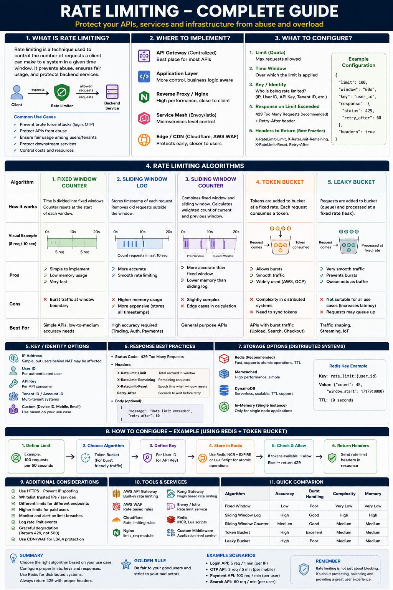

```js
React
  │
  │ 1. Login with Google
  ▼
Your Backend
https://api.myapp.com/auth/google
  │
  │ 2. Redirect browser
  ▼
Google
  │
  │ 3. Login + Consent
  │
  │ 4. Redirect browser to
  │    https://api.myapp.com/auth/google/callback?code=ABC
  ▼
Your Backend
https://api.myapp.com/auth/google/callback
  │
  │ 5. Code → Access Token
  │
  │ 6. Get Google user
  ▼
Your DB
  │
  │ 7. Find/Create user
  ▼
Your Backend
  │
  │ 8. Set session cookie
  │
  │ 9. Redirect browser
  ▼
React
https://myapp.com/dashboard
```

First stage mein Google user ko authenticate/authorize karta hai aur backend ko temporary authorization code deta hai. Backend state verify karke ensure karta hai ki callback expected OAuth flow se aaya hai. Second stage mein backend us authorization code ko apni client credentials ke saath Google ke token endpoint par exchange karta hai, jahan Google code aur client details validate karke access token issue karta hai.


## OAuth
